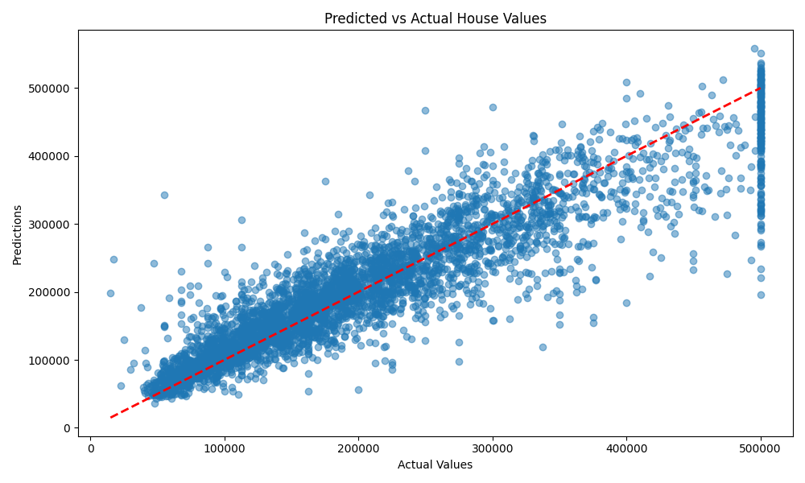

# California_House_Predictor

**California_House_Predictor** is a machine learning project for predicting house prices in California using advanced regression models and a robust data preprocessing pipeline. This project automates data cleaning, feature engineering, model selection, training, evaluation, and inference.

## Table of Contents
- [Project Overview](#project-overview)
- [Installation](#installation)
- [Usage](#usage)
- [Model Training & Evaluation](#model-training--evaluation)
- [Visualizations](#visualizations)
- [Technologies Used](#technologies-used)
---

## Project Overview

The primary goal is to build a regression model that accurately predicts housing prices based on data from the 1990 California census. The project implements a complete machine learning pipeline:

*   **Data Preprocessing**: Handles missing values, scales numerical features, and encodes categorical features.
*   **Model Training**: Compares three different regression models: Random Forest, Gradient Boosting, and Support Vector Regressor (SVR).
*   **Hyperparameter Tuning**: Uses `GridSearchCV` to find the optimal hyperparameters for each model.
*   **Evaluation**: Selects the best-performing model based on Root Mean Squared Error (RMSE) and evaluates its performance on a held-out test set.
*   **Inference**: Saves the trained model and preprocessing pipeline for future use, allowing for quick predictions on new data.

## Getting Started

Follow these instructions to set up and run the project locally.

### Prerequisites

*   Python 3.8+
*   The dataset file `housing.csv` must be in the root directory.

### Installation

1.  Clone the repository:
    ```
    git clone https://github.com/<your_username>/California_House_Predictor.git
    cd California_House_Predictor
    ```

2.  Create and activate a virtual environment:
    ```
    # For Windows
    python -m venv venv
    .\venv\Scripts\activate

    # For macOS/Linux
    python3 -m venv venv
    source venv/bin/activate
    ```

3.  Install the required packages from `requirements.txt`:
    ```
    pip install -r requirements.txt
    ```

## Usage

The `main.py` script handles both model training and inference workflows.

### Model Training & Evaluation

To train the model from scratch, ensure that `model.pkl` and `pipeline.pkl` do not exist in the root directory. Then, run the script: python main.py

The script will perform the following steps:
1.  Load the `housing.csv` dataset.
2.  Perform stratified splitting to create training and test sets.
3.  Build and apply a preprocessing pipeline.
4.  Run a grid search to find the best model (`Random Forest`, `Gradient Boosting`, or `SVR`).
5.  Train the best model on the full training set.
6.  Evaluate the model and print performance metrics.
7.  Save the final model as `model.pkl` and the pipeline as `pipeline.pkl`.

### Inference

If `model.pkl` and `pipeline.pkl` already exist, running the script will trigger the inference mode: python main.py

This loads the saved model and pipeline, makes predictions on the `housing.csv` data, and saves the results to `output.csv`.

## Model Performance

The script compares multiple models, and the **Gradient Boosting Regressor** was selected as the best performer.

### Grid Search Results

| Model | Best RMSE | Best Parameters |
| :--- | :--- | :--- |
| Random Forest | 50367.56 | `{'max_depth': None, 'min_samples_leaf': 2, 'min_samples_split': 2, 'n_estimators': 200}` |
| **Gradient Boosting** | **50025.35** | **`{'learning_rate': 0.1, 'max_depth': 4, 'min_samples_split': 2, 'n_estimators': 200}`** |
| SVR | 87083.16 | `{'C': 10, 'gamma': 'scale', 'kernel': 'linear'}` |

### Final Model Evaluation

*   **Test RMSE**: 47259.87
*   **Test R² Score**: 0.9286

## Visualizations

The script generates the following plots to help visualize model performance and data insights:
1.  **Predicted vs. Actual Values**: A scatter plot to compare the model's predictions against the actual housing values.
   
3.  **Feature Importance**: A bar plot showing the most influential features for the best-performing model.

## Technologies Used

*   **Python**
*   **Pandas**: For data manipulation and analysis.
*   **NumPy**: For numerical operations.
*   **Scikit-learn**: For building the machine learning pipeline, modeling, and evaluation.
*   **Matplotlib & Seaborn**: For data visualization.
*   **Joblib**: For saving and loading the trained model and pipeline.

